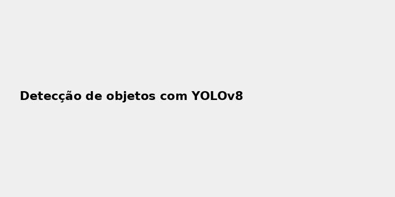
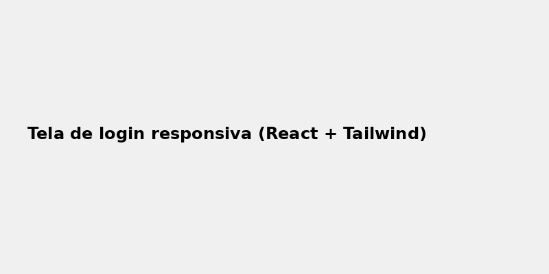
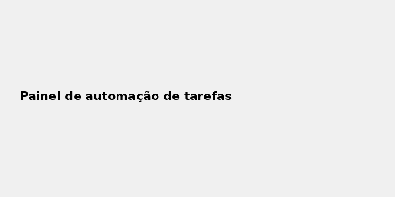

# 🛠️ TechForgeLab

Bem-vindo ao **TechForgeLab** – um laboratório de ideias, protótipos e projetos voltados para tecnologia, inovação e automação!

Aqui você encontrará desde aplicações em inteligência artificial, passando por soluções web modernas, até ferramentas para automatizar tarefas do dia a dia.

---

## 🚀 Projetos em destaque

### 1. 🤖 AI Project
- 🔍 Detecção de objetos com YOLOv8
- 🧠 Classificador de sentimentos com redes neurais
- 🔗 Integração com APIs externas (ChatGPT, Google Vision)

### 2. 🌐 Web App
- 🧩 Frontend em React + TailwindCSS
- 🛡️ Backend com Node.js + Express
- 📦 Banco de dados MongoDB

### 3. ⚙️ Automation Tool
- 📤 Envio automático de relatórios via e-mail
- 📊 Coleta de dados de sites (web scraping)
- 📌 Integração com Google Sheets e Notion API

---

## 🖼️ Prints e Visão Geral

### AI Project

*Sistema identificando objetos em tempo real.*

### Web App

*Interface leve e moderna com suporte mobile.*

### Automation Tool

*Painel com logs e status das tarefas agendadas.*

---

## 💡 Insights e Possibilidades

- Cada projeto é modular, pronto para reaproveitamento e adaptação.
- Ideal para estudos, apresentações acadêmicas e até uso profissional.
- Código limpo, documentado e aberto para contribuição.

---

## 🤝 Contribua

Sinta-se livre para abrir *issues*, propor melhorias ou enviar um *pull request*. Vamos construir algo incrível juntos!

---

## 📄 Licença

Este repositório está licenciado sob a [MIT License](LICENSE).
